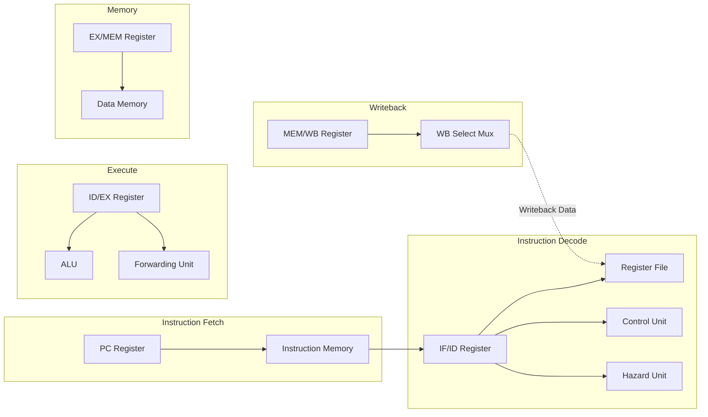

# RISC-V 5-Stage Pipelined Processor with Hazard Detection & Forwarding

A synthesizable 5-Stage Pipelined RV32I+M RISC-V core implemented in Verilog, with machine-mode CSRs/exceptions, a verification harness backed by an independent reference-model simulator, and an interactive pipeline visualizer. This processor implements the standard RISC-V pipeline stages (Fetch, Decode, Execute, Memory, Writeback) and features hardware-level hazard mitigation, including a dynamic Forwarding Unit for RAW hazards, a Hazard Detection Unit for load-use stalls, and pipeline flushing for control hazards.

The processor architecture is divided into five distinct stages separated by intermediate pipeline registers (reg1 to reg4):

## Project status

RV32I base ISA is complete (R/I-type ALU ops, byte/halfword/word loads and
stores, all standard branches plus two custom ones, `jal`/`jalr`,
`lui`/`auipc`), plus RV32M (`mul`/`div`/`rem` and unsigned variants, with a
real multi-cycle iterative divider, not a single-cycle shortcut) and
machine-mode CSRs/synchronous exceptions (`csrrw`/`csrrs`/`csrrc`(+`i`),
`ecall`/`ebreak` traps, `mret`). Only `fence` (a no-op on this in-order,
single-hart design) and real interrupts (no hardware interrupt source
exists to drive them) remain unimplemented, both by design.

A self-checking directed test suite (`sim/run_tests.sh` / `make test`)
covers ISA coverage, forwarding, hazards, multi-cycle division, CSR/
exception handling, and branch/jump resolution -- **22 tests / 122 checks,
all passing** -- backed by an independent reference-model instruction set
simulator (`sim/tools/iss.py`) for constrained-random cross-checking
(`make random-test`), 4 embedded RTL invariant assertions, and functional
coverage tracking (`make coverage`). An interactive pipeline visualizer
(`make viewer`) replays a real execution trace with stalls, squashes,
forwarding, and branches color-coded.

FPGA bring-up scaffolding exists (`fpga/top.v`, a generic XDC constraints
template, a standalone unit-tested synchronous-read memory) but is not yet
integrated into the live pipeline or validated on real hardware -- see
[docs/adr/0012-fpga-readiness.md](docs/adr/0012-fpga-readiness.md) for what's
done and what's left.

This project is under active development toward a broader research-platform
goal (caches, branch prediction, real hardware bring-up, benchmarking).
See [docs/ARCHITECTURE.md](docs/ARCHITECTURE.md) for the full technical
audit and [docs/ROADMAP.md](docs/ROADMAP.md) for the phased backlog;
`docs/adr/` has the design rationale -- including every real bug found and
fixed along the way -- for every non-trivial change so far.
