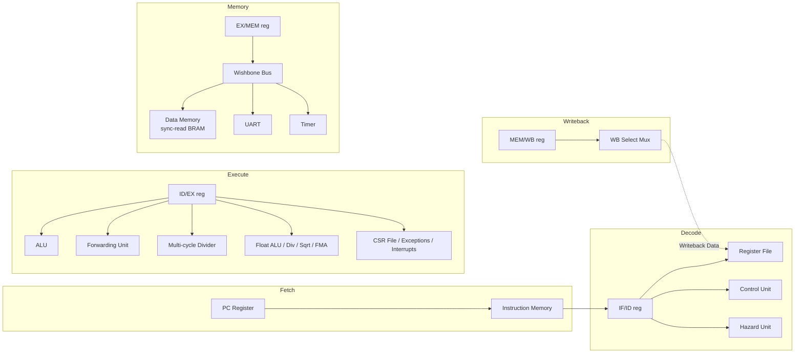
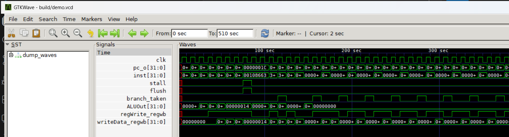

<div align="center">

# RV32IM(F) 5-Stage Pipelined RISC-V Core

**A synthesizable, hardware-verified 5-stage in-order RISC-V pipeline — forwarding, hazard detection,
a real multi-cycle divider, single-precision floating point, machine-mode CSRs/exceptions, real
asynchronous interrupts, an on-chip bus with UART and timer peripherals, and an interactive
cycle-accurate visualizer.**

-2f7fd6?style=flat-square)


</div>

---

Every number in this README is read off real simulation output, not aspirational. The project's own
rule: nothing gets claimed as "done" until it's been run under Icarus Verilog and, for anything that
touches RTL behavior, cross-checked against an independent reference simulator. `docs/adr/` has the
receipts — including every real bug this process has found and fixed.

## Contents

- [What this is](#what-this-is)
- [Architecture](#architecture)
- [RV32F floating point](#rv32f-floating-point)
- [SoC integration: bus, UART, timer, real interrupts](#soc-integration-bus-uart-timer-real-interrupts)
- [Project status](#project-status)
- [Verification](#verification)
- [Hazard strategies & pipeline depth: research-platform toggles](#hazard-strategies--pipeline-depth-research-platform-toggles)
- [Benchmarks](#benchmarks)
- [Toolchain & tooling](#toolchain--tooling)
- [Getting started](#getting-started)
- [Repository layout](#repository-layout)
- [Documentation](#documentation)

## What this is

A classic 5-stage in-order RISC-V core — **Fetch → Decode → Execute → Memory → Writeback** — implemented
from scratch in Verilog, taken well past "it runs one test program" into territory most student/hobby
cores don't reach:

- **RV32I + M + F**, complete: full ALU/branch/jump/load-store ISA, `mul`/`div`/`rem` (and unsigned
  variants) backed by a genuine 32-cycle iterative divider, and full single-precision floating point —
  `fadd.s`/`fsub.s`/`fmul.s`/`fdiv.s`/`fsqrt.s`, the fused multiply-add family, comparisons/conversions/
  sign-injection, full float register forwarding, and live `fflags`/`frm`.
- **Machine-mode CSRs, synchronous exceptions, and real asynchronous interrupts**: `csrrw`/`csrrs`/
  `csrrc`(`+i`), `ecall`/`ebreak` traps, `mret`, illegal-instruction detection, plus a real timer and
  UART-RX-ready hardware interrupt source with a correctly-designed redirect path (`mie`/`mip`,
  spec-mandated external-over-timer priority).
- **A real on-chip bus**: a classic Wishbone-style handshake connects the LSU to data memory, a
  cycle-accurate UART (real bit-shifted 8N1 serial framing), and a CLINT-style timer — not a single
  flat memory device with no address decoding.
- **Hardware hazard handling**: a forwarding unit resolves most RAW hazards same-cycle; a hazard-detection
  unit stalls the one case forwarding can't fix (load-use); control hazards flush speculatively-fetched
  instructions on a resolved branch, jump, trap, or interrupt.
- **Two research-platform toggles at elaboration time, zero cost when unused**: swappable hazard
  strategy (forwarding vs. stall-only) and swappable pipeline depth (5-stage vs. a split-fetch 6-stage
  profile) — both independently benchmarked, not just implemented.
- **Verified against an independent instruction-set simulator**, not just directed tests — including an
  interrupt-injection mode that fires real, unpredictably-timed interrupts mid-random-program and still
  requires bit-for-bit agreement. See [Verification](#verification).
- **FPGA-ready scaffolding**: parameterized memory sizes, a vendor-neutral top level, a debug
  observability port. Not yet validated on real hardware — see [Project status](#project-status).

## Architecture

Five stages, separated by four pipeline registers (`reg1`–`reg4`), in the default profile:



| Stage | Responsibility | Key modules |
|---|---|---|
| **IF** | PC-driven instruction fetch; redirected on taken branches, jumps, trap/`mret`/interrupt targets | `PC.v`, `InstructionMemory.v` |
| **ID** | Decode, register-file read (integer + float), immediate generation, hazard detection | `Control.v`, `Hazard.v` / `HazardNoForward.v`, `ImmGen.v`, `FRegister.v` |
| **EX** | ALU, branch resolution, forwarding muxes, multi-cycle divide, float ALU/divide/sqrt/FMA, CSR read/write, interrupt detection | `ALU.v`, `Forward.v`, `FForward.v`, `Divider.v`, `FALU.v`, `FDivider.v`, `FSqrt.v`, `FMADDUnit.v`, `CSR.v` |
| **MEM** | Wishbone bus decode/mux to data memory, UART, or timer | `WbDecoder.v`, `RamWishboneAdapter.v`, `DataMemoryBRAM.v`, `Uart.v`, `Timer.v` |
| **WB** | Selects ALU / float / memory / PC+4 result back into the integer or float register file | `Register.v`, `FRegister.v`, `Mux4to1.v` |

A `PIPELINE_PROFILE` parameter (elaboration time, default 5-stage, bit-exact) swaps in a split-fetch
6-stage alternate — see [Hazard strategies & pipeline depth](#hazard-strategies--pipeline-depth-research-platform-toggles).

## RV32F floating point

Full single-precision extension, not a reduced subset: `fadd.s`/`fsub.s`/`fmul.s`/`fdiv.s`/`fsqrt.s`,
the `fmadd.s`/`fmsub.s`/`fnmsub.s`/`fnmadd.s` fused multiply-add family (rounded once, not twice),
`fsgnj.s`/`fsgnjn.s`/`fsgnjx.s`, `fmin.s`/`fmax.s`, `feq.s`/`flt.s`/`fle.s`, `fcvt.w.s`/`fcvt.wu.s`/
`fcvt.s.w`/`fcvt.s.wu`, `fmv.x.w`/`fmv.w.x`/`fclass.s`, and a live `fflags`/`frm`/`fcsr` with full
static and dynamic rounding-mode support. A separate 32-register float file (`FRegister.v`) gets its
own full forwarding network (`FForward.v`) from day one, not a stall-only placeholder. Subnormals flush
to zero on input and output (a documented, common simplification for a hand-written FPU); no NaN-boxing
(this core is F-only, so it's genuinely moot, not skipped for convenience).

Verified against a standalone Python reference model using exact rational arithmetic (so every rounding
mode could be checked precisely, not just round-to-nearest) before being wired into the live
constrained-random cross-check oracle — see `docs/adr/0019-f-extension.md` for the full story,
including four real RTL bugs it found (one of which had silently shipped through three prior
integration steps before an independent reference model caught it).

## SoC integration: bus, UART, timer, real interrupts

`design/DataMemoryBRAM.v` used to be the *only* addressable device, with no bus in front of it at all.
It now sits behind a classic (non-pipelined) Wishbone-style handshake (`design/WbDecoder.v` — a
parameterized address decoder/mux — plus `design/RamWishboneAdapter.v`, a thin wrapper that gives it a
bus interface without modifying a single line of the already-verified memory module), alongside two new
memory-mapped peripherals:

- **`design/Uart.v`** — cycle-accurate, not a behavioral shortcut: real start/8-data/stop-bit serial
  framing, shifted one bit at a time against a fixed `CLKS_PER_BIT` divisor, with RX midpoint sampling
  (standard receiver practice, avoids catching transition jitter).
- **`design/Timer.v`** — a free-running RISC-V CLINT-style `mtime`/`mtimecmp` machine-timer peripheral.

Both peripherals can raise a real, correctly-prioritized hardware interrupt. `CSR.v` gained `mie`/`mip`
(machine-timer and machine-external interrupt enable/pending bits) and `mcause`'s interrupt-vs-exception
bit; `riscvpipeline.v` gained an interrupt-detection point that's genuinely independent of whatever
instruction is currently executing — unlike every synchronous exception this core already had — correctly
computing `mepc` as "the instruction that would have executed next" (not the faulting instruction's own
PC), gated so it never interrupts a multi-cycle divide/float-op/load mid-flight, with spec-mandated
external-over-timer priority when both are pending at once.

Verifying an unpredictably-timed asynchronous event against a sequential instruction-set-simulator
reference — without resorting to real cycle-accurate co-simulation — turned out to be the hardest part
of this whole project. The short version: an architecturally inert injected interrupt handler means the
RTL's real hardware timing and the ISS's own independently-scheduled firing point don't actually need to
agree on the exact instruction boundary, only that each fires at most once. See
`docs/adr/0020-soc-integration.md` for the full design story, including a real `CSR.v` correctness bug
(an unrelated CSR write silently dropped whenever an interrupt happened to fire the same cycle) that
only became possible once the interrupt redirect made trap entry independent of what's executing — not
caught until a 100-seed random sweep, well past this feature's own directed tests.

## Project status

RV32I base ISA, RV32M, RV32F, machine-mode CSRs/synchronous exceptions, and real asynchronous
interrupts (timer + UART RX) are all complete. Only `fence` (a no-op on this in-order, single-hart
design — nothing for it to order) remains unimplemented, by design.

| Area | Status |
|---|---|
| RV32I base ISA | ✅ Complete |
| RV32M (`mul`/`div`/`rem`) | ✅ Complete, real multi-cycle divider |
| RV32F (single-precision float) | ✅ Complete, full forwarding, full FMA/div/sqrt |
| CSRs + M-mode exceptions | ✅ Complete |
| Real asynchronous interrupts (timer + UART) | ✅ Complete, spec-mandated priority |
| On-chip Wishbone-style bus + UART + timer | ✅ Complete |
| Hazard forwarding + stall-only comparison | ✅ Complete, elaboration-time swappable |
| Pipeline depth: 5-stage vs. split-fetch 6-stage | ✅ Complete, elaboration-time swappable |
| MEM-stage retiming (sync-read BRAM) | ✅ Complete |
| `XLEN` / `NUM_REGS` parameterization | ✅ Complete |
| Directed + random-cross-check verification (incl. interrupt injection) | ✅ Complete, see below |
| Interactive pipeline visualizer | ✅ Complete |
| Independent-ISS step debugger | ✅ Complete |
| Compiled-C toolchain (real GCC → this core) | ✅ Infrastructure verified end-to-end |
| Dhrystone port | ✅ Verified correct — all 6 documented expected values match exactly (462,126 cycles, `Number_Of_Runs=500`) |
| CoreMark port | 🚧 Correct at reduced size (`TOTAL_DATA_SIZE=400`, 37,323 cycles, no hang) — the standard, citable `TOTAL_DATA_SIZE=2000` configuration hasn't completed a clean run yet |
| FPGA real-hardware validation | 🚧 Scaffolding hardened (`fpga/build.tcl`, `fpga/README.md`), not yet run against a real toolchain or board |
| Signal-naming/port-ordering consistency pass | 🚧 Deliberately deferred — every testbench references internal signals via hierarchical paths, so a rename needs its own dedicated, separately-verified pass |
| Performance work (branch prediction, caches, dual-issue) | ⏳ Not started — the next phase after this SoC integration work |

## Verification

Directed tests only catch what you thought to test for. This core is also cross-checked against
**`sim/tools/iss.py`**, an independent instruction-set simulator with no shared code path to the RTL —
constrained-random programs run on both, and any divergence is treated as a real bug. That process alone
has found and fixed dozens of real RTL bugs no directed test caught (see `docs/adr/`).

- **47/47 directed tests, 655/655 checks** — ISA coverage, forwarding, hazards, multi-cycle division,
  float arithmetic/divide/sqrt/FMA, CSR/exception handling, branch/jump resolution, bus/UART/timer
  behavior, and interrupt redirect correctness (including MEI-over-MTI priority and an interrupt
  correctly deferred, not dropped, while `mstatus.MIE=0`).
- **1000+ constrained-random programs** matched bit-for-bit against the independent ISS reference model
  across this project's history (`make random-test`) — including an opt-in interrupt-injection mode
  (`--interrupt timer|uart|both`) that fires a real, unpredictably-timed interrupt mid-random-program on
  the RTL side while the ISS independently schedules its own, and still requires exact agreement on
  final architectural state.
- **4 embedded RTL invariant assertions** (forwarding-select legality, stall/flush consistency, `x0`
  hard-wired to zero, store-forwarding correctness) — each verified to actually fire by deliberately
  reintroducing the bug it guards against.
- **Functional coverage tracking** (`make coverage`) — closed a real gap where `bne` was untested by any
  directed program until coverage caught it.
- **Zero-warning `iverilog -Wall` compile** across the whole design.

## Hazard strategies & pipeline depth: research-platform toggles

Two independent axes are swappable at elaboration time, zero cost when unused, each independently
benchmarked against the hand-written kernels.

**Hazard strategy** (`riscvpipeline.v`'s `HAZARD_STRATEGY` parameter): the default forwarding unit vs.
`HazardNoForward.v`, which stalls on every RAW hazard instead of forwarding.

| Kernel | Forwarding | Stall-only | Cost of removing forwarding |
|---|---:|---:|---:|
| `bench_fib` | baseline | — | **+43.3%** cycles |
| `bench_bubble_sort` | baseline | — | **+36.1%** cycles |
| `bench_sum_array` | baseline | — | **+30.8%** cycles |

**Pipeline depth** (`riscvpipeline.v`'s `PIPELINE_PROFILE` parameter): the default 5-stage structure vs.
`PROFILE_6STAGE_SPLIT_FETCH`, a new IF1/IF2 relay register ahead of the existing IF/ID boundary.

| Kernel | 5-stage | 6-stage split-fetch | Cost of the extra fetch stage |
|---|---:|---:|---:|
| `bench_fib` | 215 cycles | 245 cycles | **+14.0%** |
| `bench_bubble_sort` | 313 cycles | 342 cycles | **+9.3%** |
| `bench_sum_array` | 263 cycles | 294 cycles | **+11.8%** |

See `docs/adr/0016-swappable-hazard-strategy.md` / `docs/adr/0018-variable-pipeline-depth.md` for full
methodology and `sim/tools/bench_runner.py --compare-strategies` / `--compare-profiles` to reproduce.

## Benchmarks

Three hand-written kernels in this core's own assembly dialect — ALU/branch-heavy, memory-load-heavy, and
mixed-with-a-data-dependent-branch respectively — each cross-checked against the ISS before its cycle
count is trusted, then measured on real RTL (`sim/tb/bench_template.v`'s generic halt detection):

| Kernel | Character | IPC |
|---|---|---:|
| `bench_fib` | Pure ALU/branch, lowest pipeline overhead | 0.716 |
| `bench_bubble_sort` | Mixed ALU, memory, data-dependent branches | 0.668 |
| `bench_sum_array` | Heaviest load density | 0.639 |

Not standardized scores — useful for relative comparison against future changes to this core, not against
other cores' published numbers. A real compiled-C toolchain (`sim/benchmarks/c/`) exists for running
industry-standard benchmarks: Dhrystone is fully verified correct, CoreMark completes correctly at a
reduced data size (see [Project status](#project-status)).

## Toolchain & tooling

| Tool | What it does |
|---|---|
| `make test` | Self-checking directed suite, PASS/FAIL summary |
| `make random-test` | Constrained-random cross-check vs. the independent ISS (`ARGS="--interrupt timer\|uart\|both"` for interrupt-injection mode) |
| `make coverage` | Functional coverage report across the directed suite |
| `make viewer` | Regenerates the interactive cycle-accurate pipeline viewer (`site/index.html`'s trace section) |
| `make debug PROGRAM=path/to/foo.s` | Interactive step debugger (`sim/tools/debugger.py`) — instant single-instruction stepping on the ISS |
| `make benchmark` | Runs the hand-written benchmark kernels and reports cycles/IPC |
| `make lint` | `iverilog -Wall` syntax/width/latch check |
| `sim/tools/build_c_bench.py` | Compile real C (GCC) → link → convert → run on the RTL, report cycles + return value |
| `sim/tb/dump_waves.v` | Full `$dumpvars(0, dut)` VCD dump of a program's execution, for any real waveform viewer (GTKWave, etc.) |

`sim/tb/dump_waves.v` replays the same `sim/programs/demo.s` the pipeline viewer above uses, but dumps
every DUT signal to `build/demo.vcd` instead of a curated CSV — open it in
[GTKWave](https://gtkwave.sourceforge.net/) (or any VCD viewer) for a full, standard-EDA-tool view of
the same execution:



## Getting started

Requires [Icarus Verilog](http://iverilog.icarus.com/) (`iverilog`/`vvp`) and Python 3 on `PATH`. On
Windows without `make`, use `sim/run_tests.sh` directly — both do the same thing.

```bash
git clone <this-repo>
cd 5-stage-pipelined-processor

make test          # run the full directed suite
make viewer         # regenerate the interactive pipeline viewer
make benchmark       # cycle/IPC numbers for the hand-written kernels
make random-test ARGS="--count 100"   # cross-check more random programs
make random-test ARGS="--count 50 --interrupt both"   # ...with interrupts firing mid-program
```

To trace a different program through the viewer: point `sim/tb/gen_trace.v`'s `INIT_FILE` at another
`sim/programs/*.s`, `make viewer` again.

## Repository layout

```
design/          RTL — every stage, functional unit, pipeline register, FPU unit, bus, and peripheral
sim/
  programs/      Hand-assembled directed test programs (this core's own tiny assembler, asm.py)
  benchmarks/    Hand-written benchmark kernels + the compiled-C toolchain (c/)
  tb/            Testbenches: directed tests, trace generation, benchmarking, C programs
  tools/         Python tooling: assembler, ISS, debugger, trace/viewer/coverage/benchmark generators
fpga/            Vendor-neutral FPGA bring-up scaffolding (not yet run on real hardware)
site/            Self-contained static pipeline-visualizer page (deployable as-is, e.g. to Vercel)
docs/
  ARCHITECTURE.md  Full technical audit of the design
  ROADMAP.md       Phased backlog — what's done, what's next, and why
  adr/             One doc per non-trivial design decision, including every real bug found and fixed
vercel.json      Points a Vercel deployment at site/ (no build step -- index.html is served as-is)
```

## Documentation

- **[docs/ARCHITECTURE.md](docs/ARCHITECTURE.md)** — full technical audit of the current design.
- **[docs/ROADMAP.md](docs/ROADMAP.md)** — phased backlog: what's done, what's next, and the reasoning
  behind the sequencing.
- **[docs/adr/](docs/adr)** — one doc per non-trivial design decision (problem, alternatives considered,
  chosen solution, validation strategy) — including every real bug this project's verification process
  has found along the way. Start with `0018` (variable pipeline depth), `0019` (RV32F), and `0020` (SoC
  integration / real interrupts) for the most recent, largest phases of work.
