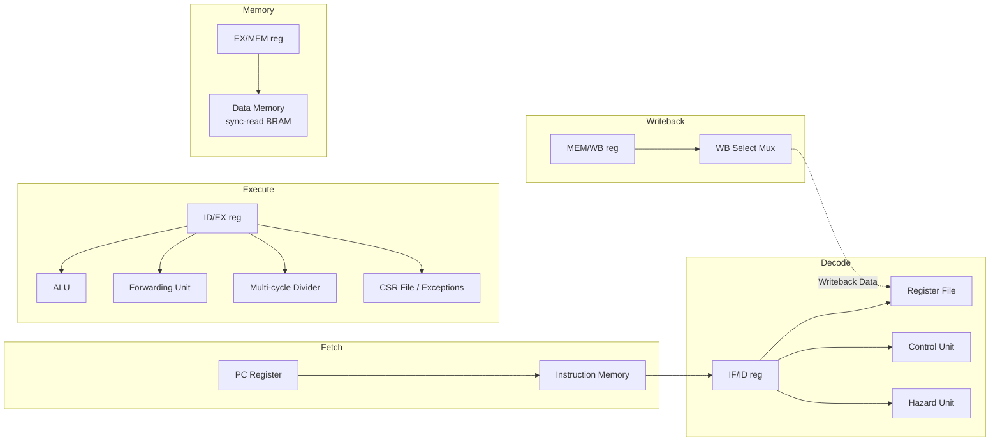

<div align="center">

# RV32IM 5-Stage Pipelined RISC-V Core

**A synthesizable, hardware-verified 5-stage in-order RISC-V pipeline — forwarding, hazard detection,
a real multi-cycle divider, machine-mode CSRs/exceptions, and an interactive cycle-accurate visualizer.**


</div>

---

Every number in this README is read off real simulation output, not aspirational. The project's own
rule: nothing gets claimed as "done" until it's been run under Icarus Verilog and, for anything that
touches RTL behavior, cross-checked against an independent reference simulator. `docs/adr/` has the
receipts — including every real bug this process has found and fixed.

## Contents

- [What this is](#what-this-is)
- [Architecture](#architecture)
- [Project status](#project-status)
- [Verification](#verification)
- [Hazard strategies: forwarding vs. stall-only](#hazard-strategies-forwarding-vs-stall-only)
- [Benchmarks](#benchmarks)
- [Toolchain & tooling](#toolchain--tooling)
- [Getting started](#getting-started)
- [Repository layout](#repository-layout)
- [Documentation](#documentation)

## What this is

A classic 5-stage in-order RISC-V core — **Fetch → Decode → Execute → Memory → Writeback** — implemented
from scratch in Verilog, taken well past "it runs one test program" into territory most student/hobby
cores don't reach:

- **RV32I + M**, complete: full ALU/branch/jump/load-store ISA, plus `mul`/`div`/`rem` (and unsigned
  variants) backed by a genuine 32-cycle iterative divider — not a single-cycle `/` shortcut.
- **Machine-mode CSRs and synchronous exceptions**: `csrrw`/`csrrs`/`csrrc`(`+i`), `ecall`/`ebreak` traps,
  `mret`, illegal-instruction detection.
- **Hardware hazard handling**: a forwarding unit resolves most RAW hazards same-cycle; a hazard-detection
  unit stalls the one case forwarding can't fix (load-use); control hazards flush speculatively-fetched
  instructions on a resolved branch, jump, or trap.
- **Swappable hazard strategy at elaboration time** — compare forwarding against stall-only hazard
  handling with a single parameter, no simulation-only shortcuts.
- **Verified against an independent instruction-set simulator**, not just directed tests — see
  [Verification](#verification).
- **FPGA-ready scaffolding**: parameterized memory sizes, a vendor-neutral top level, a debug
  observability port. Not yet validated on real hardware — see [Project status](#project-status).

## Architecture

Five stages, separated by four pipeline registers (`reg1`–`reg4`):



| Stage | Responsibility | Key modules |
|---|---|---|
| **IF** | PC-driven instruction fetch; redirected on taken branches, jumps, and trap/`mret` targets | `PC.v`, `InstructionMemory.v` |
| **ID** | Decode, register-file read, immediate generation, hazard detection | `Control.v`, `Hazard.v` / `HazardNoForward.v`, `ImmGen.v` |
| **EX** | ALU, branch resolution, forwarding muxes, multi-cycle divide, CSR read/write | `ALU.v`, `Forward.v`, `Divider.v`, `CSR.v` |
| **MEM** | Synchronous-read data memory (BRAM-style), byte/halfword/word aligned | `DataMemoryBRAM.v` |
| **WB** | Selects ALU result / memory data / PC+4 back into the register file | `Register.v`, `Mux4to1.v` |

## Project status

RV32I base ISA is complete (R/I-type ALU ops, byte/halfword/word loads and stores, all standard
branches plus two custom ones, `jal`/`jalr`, `lui`/`auipc`), plus RV32M and machine-mode CSRs/synchronous
exceptions. Only `fence` (a no-op on this in-order, single-hart design) and real interrupts (no hardware
interrupt source exists to drive them) remain unimplemented, both by design.

| Area | Status |
|---|---|
| RV32I base ISA | ✅ Complete |
| RV32M (`mul`/`div`/`rem`) | ✅ Complete, real multi-cycle divider |
| CSRs + M-mode exceptions | ✅ Complete |
| Hazard forwarding + stall-only comparison | ✅ Complete, elaboration-time swappable |
| MEM-stage retiming (sync-read BRAM) | ✅ Complete |
| `XLEN` / `NUM_REGS` parameterization | ✅ Complete |
| Directed + random-cross-check verification | ✅ Complete, see below |
| Interactive pipeline visualizer | ✅ Complete |
| Independent-ISS step debugger | ✅ Complete |
| Compiled-C toolchain (real GCC → this core) | ✅ Infrastructure verified end-to-end |
| CoreMark / Dhrystone ports | 🚧 In progress |
| FPGA real-hardware validation | 🚧 Scaffolding done, not yet run on a board |
| Variable pipeline depth | ⏸ Deliberately out of scope — see `docs/ROADMAP.md` Phase 6 |

## Verification

Directed tests only catch what you thought to test for. This core is also cross-checked against
**`sim/tools/iss.py`**, an independent instruction-set simulator with no shared code path to the RTL —
constrained-random programs run on both, and any divergence is treated as a real bug. That process alone
has found and fixed over a dozen real RTL bugs no directed test caught (see `docs/adr/`).

- **25/25 directed tests, 136/136 checks** — ISA coverage, forwarding, hazards, multi-cycle division,
  CSR/exception handling, branch/jump resolution.
- **350+ constrained-random programs** matched bit-for-bit against the independent ISS reference model
  (`make random-test`).
- **4 embedded RTL invariant assertions** (forwarding-select legality, stall/flush consistency, `x0`
  hard-wired to zero, store-forwarding correctness) — each verified to actually fire by deliberately
  reintroducing the bug it guards against.
- **Functional coverage tracking** (`make coverage`) — closed a real gap where `bne` was untested by any
  directed program until coverage caught it.
- **Zero-warning `iverilog -Wall` compile** across the whole design.

## Hazard strategies: forwarding vs. stall-only

The hazard unit is swappable at elaboration time (`riscvpipeline.v`'s `HAZARD_STRATEGY` parameter, zero
cost when unused) between the default forwarding unit and `HazardNoForward.v`, which stalls on every RAW
hazard instead of forwarding. Running the benchmark kernels under both quantifies exactly what forwarding
buys this core:

| Kernel | Forwarding | Stall-only | Cost of removing forwarding |
|---|---:|---:|---:|
| `bench_fib` | baseline | — | **+43.3%** cycles |
| `bench_bubble_sort` | baseline | — | **+36.1%** cycles |
| `bench_sum_array` | baseline | — | **+30.8%** cycles |

See `docs/adr/0016-swappable-hazard-strategy.md` for the full methodology and `sim/tools/bench_runner.py
--compare-strategies` to reproduce.

## Benchmarks

Three hand-written kernels in this core's own assembly dialect — ALU/branch-heavy, memory-load-heavy, and
mixed-with-a-data-dependent-branch respectively — each cross-checked against the ISS before its cycle
count is trusted, then measured on real RTL (`sim/tb/bench_template.v`'s generic halt detection):

| Kernel | Character | IPC |
|---|---|---:|
| `bench_fib` | Pure ALU/branch, lowest pipeline overhead | 0.716 |
| `bench_bubble_sort` | Mixed ALU, memory, data-dependent branches | 0.668 |
| `bench_sum_array` | Heaviest load density | 0.639 |

Not standardized scores — useful for relative comparison against future changes to this core, not against
other cores' published numbers. A real compiled-C toolchain (`sim/benchmarks/c/`) now exists for running
industry-standard benchmarks (CoreMark/Dhrystone); ports are in progress.

## Toolchain & tooling

| Tool | What it does |
|---|---|
| `make test` | Self-checking directed suite, PASS/FAIL summary |
| `make random-test` | Constrained-random cross-check vs. the independent ISS |
| `make coverage` | Functional coverage report across the directed suite |
| `make viewer` | Regenerates the interactive cycle-accurate pipeline viewer (`site/index.html`'s trace section) |
| `make debug PROGRAM=path/to/foo.s` | Interactive step debugger (`sim/tools/debugger.py`) — instant single-instruction stepping on the ISS |
| `make benchmark` | Runs the hand-written benchmark kernels and reports cycles/IPC |
| `make lint` | `iverilog -Wall` syntax/width/latch check |
| `sim/tools/build_c_bench.py` | Compile real C (GCC) → link → convert → run on the RTL, report cycles + return value |

## Getting started

Requires [Icarus Verilog](http://iverilog.icarus.com/) (`iverilog`/`vvp`) and Python 3 on `PATH`. On
Windows without `make`, use `sim/run_tests.sh` directly — both do the same thing.

```bash
git clone <this-repo>
cd 5-stage-pipelined-processor

make test          # run the full directed suite
make viewer         # regenerate the interactive pipeline viewer
make benchmark       # cycle/IPC numbers for the hand-written kernels
make random-test ARGS="--count 100"   # cross-check more random programs
```

To trace a different program through the viewer: point `sim/tb/gen_trace.v`'s `INIT_FILE` at another
`sim/programs/*.s`, `make viewer` again.

## Repository layout

```
design/          RTL — every stage, functional unit, and pipeline register
sim/
  programs/      Hand-assembled directed test programs (this core's own tiny assembler, asm.py)
  benchmarks/    Hand-written benchmark kernels + the compiled-C toolchain (c/)
  tb/            Testbenches: directed tests, trace generation, benchmarking, C programs
  tools/         Python tooling: assembler, ISS, debugger, trace/viewer/coverage/benchmark generators
fpga/            Vendor-neutral FPGA bring-up scaffolding (not yet run on real hardware)
site/            Self-contained static pipeline-visualizer page (deployable as-is, e.g. to Vercel)
docs/
  ARCHITECTURE.md  Full technical audit of the design
  ROADMAP.md       Phased backlog — what's done, what's next, and why
  adr/             One doc per non-trivial design decision, including every real bug found and fixed
vercel.json      Points a Vercel deployment at site/ (no build step -- index.html is served as-is)
```

## Documentation

- **[docs/ARCHITECTURE.md](docs/ARCHITECTURE.md)** — full technical audit of the current design.
- **[docs/ROADMAP.md](docs/ROADMAP.md)** — phased backlog: what's done, what's next, and the reasoning
  behind the sequencing.
- **[docs/adr/](docs/adr)** — one doc per non-trivial design decision (problem, alternatives considered,
  chosen solution, validation strategy) — including every real bug this project's verification process
  has found along the way.
