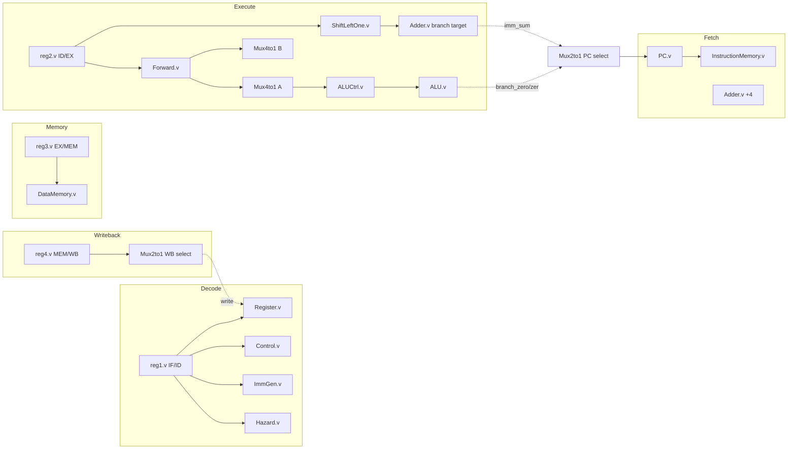

# Architecture Report — RV32I 5-Stage Pipeline

**Status**: Phase 1 audit (baseline as of this document's authoring), now updated with real findings from Phase 3 verification work. Assume correctness only where verified below; everywhere else, "assumed correct" means "not yet proven wrong," not "proven right."

## Errata (added after building the verification harness)

This audit was originally static analysis only (§0). Once a directed test
suite existed and actually ran (`sim/run_tests.sh`, 8 tests / 36 checks, all
passing as of this update), it immediately found three real bugs that
reading the RTL had not surfaced -- concrete evidence for why §15 ranked
verification as the highest-leverage next investment rather than a nice-to-have:

1. **`ALU.v`'s `sra` didn't sign-extend** -- `A`/`B` are plain (unsigned)
   ports, so Verilog's `>>>` silently degraded to a logical shift. Fixed
   with `$signed(A) >>> B`.
2. **Register-file same-cycle write/read race, gap=3** -- `Register.v` had
   no write-first bypass, and neither `Forward.v` (covers gap=1/2) nor
   `Hazard.v` (covers load-use) covered the specific case where a
   producer's WB cycle exactly coincides with a different instruction's ID
   read (concretely: producer and consumer exactly 3 instructions apart).
   See `docs/adr/0002-register-file-write-first-bypass.md`.
3. **Store data bypassed forwarding entirely** -- `reg3`'s store-data input
   was wired to the raw, unforwarded `readData2_regde` instead of the
   already-correctly-computed `readData2_final`. Any `sw` whose data
   register was written 1-2 instructions earlier stored stale data. See
   `docs/adr/0003-store-data-forwarding.md`.
4. **`slt`/`blt`/`bge`/`ble`/`bgt` compared as unsigned** -- the same root
   cause as the `sra` bug (plain, non-`signed` ALU ports), found while
   implementing `bltu`/`bgeu` and fixed in the same pass. See
   `docs/adr/0004-signed-arithmetic-casts.md`.

Also implemented in this pass: `jal` (previously decoded but functionally
inert, §11) is now fully wired -- target, link value, and forwarding
correction (`docs/adr/0001-jal-implementation.md`) -- followed by the rest
of RV32I completeness: `jalr`, `lui`, `auipc`, `bltu`/`bgeu`, and
byte/halfword loads/stores (`docs/adr/0005-isa-completeness.md`). §11's ISA coverage
table and §15's readiness table are otherwise still accurate as written;
this errata doesn't change them, it documents what the errata itself
found.

## 0. Scope of this audit

Every RTL file in `design/` and the testbench in `simulation/` was read in full. No synthesis, lint, or simulation run has been performed as part of this audit — the findings below are static-analysis (read-the-RTL) findings. Section 13 explicitly separates "observed in code" from "would need simulation/synthesis to confirm."

## 1. Block diagram



This matches the diagram in [README.md](../README.md) but adds the two feedback paths that the README omits: the writeback-to-regfile path and, more importantly, the **EX-stage-to-fetch-stage branch resolution path**, which is the most architecturally significant (and riskiest) wire in the design — see §8.

## 2. Module inventory

| Module | File | Parameterized? | Role |
|---|---|---|---|
| `PIPELINED` | `riscvpipeline.v` | No | Top-level integration |
| `PC` | `PC.v` | No | Program counter register, stall-holds |
| `Adder` | `Adder.v` | No (fixed 32-bit) | Generic add; reused for PC+4 and branch target |
| `InstructionMemory` | `InstructionMemory.v` | No | 128-byte instruction ROM, `$readmemb`-loaded |
| `reg1` | `reg1.v` | No | IF/ID register; also does branch-squash and stall-hold |
| `Control` | `Control.v` | No | Main decoder (opcode → control signals) |
| `ImmGen` | `ImmGen.v` | `Width` (unused in practice — always 32) | Immediate extraction |
| `Register` | `Register.v` | No | 32×32 register file, `x0` hardwired, `sp` reset to 128 |
| `Hazard` | `Hazard.v` | No | Load-use RAW hazard → stall/flush |
| `reg2` | `reg2.v` | No | ID/EX register; also does branch-squash and load-use bubble |
| `Forward` | `Forward.v` | No | EX/MEM & MEM/WB forwarding priority logic |
| `ShiftLeftOne` | `ShiftLeftOne.v` | No | `imm << 1` for branch target |
| `Mux4to1` | `Mux4to1.v` | `size` | ALU operand forwarding mux (only 3 of 4 select codes used) |
| `Mux2to1` | `Mux2to1.v` | `size` | Generic 2:1 mux, reused 3× (PC select, ALU-B select, WB select) |
| `ALUCtrl` | `ALUCtrl.v` | No | ALUOp + funct3/funct7 → 5-bit ALU opcode |
| `ALU` | `ALU.v` | No | Execute unit; also computes branch conditions |
| `reg3` | `reg3.v` | No | EX/MEM register |
| `DataMemory` | `DataMemory.v` | No | 128-byte data RAM, word-only access |
| `reg4` | `reg4.v` | No | MEM/WB register |

**Reuse is already present** (`Adder` used twice, `Mux2to1` used three times) — this is a good foundation for the "reusable IP" objective, but the reuse stops at trivial combinational primitives. None of the stage-specific logic (`Control`, `ALUCtrl`, `Hazard`, `Forward`) is written against a shared types/constants package, so there is no single source of truth for opcode values, ALUCtl encodings, or pipeline register field layouts. Every module re-derives bit widths and magic numbers independently.

## 3. Pipeline register contents (the actual "architecture" of this CPU)

### `reg1` (IF/ID)
| Field | Width | Purpose |
|---|---|---|
| `inst_regfd` | 32 | Fetched instruction |
| `pc_o_regfd` | 32 | PC of fetched instruction |

Squash behavior: on `branch_regde & zero` → loads `0x00000013` (`nop`) and `pc=0`. On `stall` → holds. This is the correct location for a load-use stall bubble (freeze IF/ID, freeze PC) but it double-encodes reset (`~rst`) and branch-squash as separate `if` arms with duplicated field lists — see §12.

### `reg2` (ID/EX)
Carries every decoded control signal (`branch`, `memRead`, `memtoReg`, `memWrite`, `ALUSrc`, `regWrite`, `ALUOp`), the destination register, both register-file read values, the immediate, funct3/funct7, and the two raw source-register numbers (needed downstream only for forwarding compare in `Forward.v`, since the actual operand values are forwarded via mux rather than at this register). This is the widest and busiest of the four pipeline registers — a natural target if `PIPELINED` is ever split into a `struct`/`packed` bus (see Roadmap R-2).

### `reg3` (EX/MEM)
Carries `ALUOut`, `readData2` (store data), destination register, and the memory/writeback control bits. Notably carries `zero`/`branch_regde`/`imm_sum` through to EX/MEM even though branch resolution has *already happened* by the time this register latches (branch resolution reads `reg2`'s outputs directly, combinationally, in the same cycle) — these three fields (`branch_regem`, `zero_regem`, `imm_sum_regem`) are dead: nothing downstream reads them. **Confirmed by grep**: no consumer of `branch_regem`, `zero_regem`, or `imm_sum_regem` exists anywhere in `riscvpipeline.v`. This is unused pipeline-register width — free to remove, and a good first PR for a new contributor.

### `reg4` (MEM/WB)
Carries `readData` (load result), `ALUOut_regem` (ALU result), destination register, `memtoReg`, `regWrite`. Minimal and clean — this is the tightest of the four registers.

## 4. Control unit (`Control.v`)

Pure combinational decoder keyed on `opcode` only (7 bits), producing `{branch, memRead, memtoReg, ALUOp[1:0], memWrite, ALUSrc, regWrite}`. `funct3`/`funct7` are *passed through* unmodified (not used for control decisions in this module) — all funct-based sub-decoding happens later in `ALUCtrl`. This is architecturally correct (matches Patterson & Hennessy's canonical single-cycle/pipelined control unit split) and is one of the cleanest modules in the repo.

Opcodes handled: `0101010` (custom), `0000011` (load), `0100011` (store), `0010011` (I-type ALU), `0110011` (R-type ALU), `1100011` (branch), `1101111` (JAL, decoded but see §11 — datapath doesn't actually support it correctly). Everything else falls into an explicit all-zero `default` — this module is fully specified and latch-free.

## 5. ALU / ALUCtrl encoding

`ALUCtrl.v` builds a 5- or 6-bit concatenation of `{ALUOp, funct7, funct3}` (R-type/I-type-shift) or `{ALUOp, funct3}` (branches, most I-type) and maps it to a 5-bit `ALUCtl`. Full opcode table:

| ALUCtl | Operation | ALUCtl | Operation |
|---|---|---|---|
| `00000` | add | `01001` | and |
| `00001` | sub | `01010` | beq |
| `00010` | sll | `01011` | bne |
| `00011` | slt | `01100` | blt |
| `00100` | sltu | `01101` | bge |
| `00101` | xor | `01110` | ble* |
| `00110` | srl | `01111` | bgt* |
| `00111` | sra | `10101` | ctz (custom) |
| `01000` | or | `11111` | illegal/default |

`*` `ble`/`bgt` are **not standard RV32I** — real RISC-V only defines `beq/bne/blt/bge/bltu/bgeu` (6 funct3 values). This design instead maps funct3 `100`/`101` to `ble`/`bgt`, meaning it diverges from the real RV32I branch encoding. This should be flagged clearly as a **custom ISA extension**, not standard RV32I, in any external-facing documentation — someone assembling with a real RISC-V toolchain (`riscv32-unknown-elf-as`) would get `bltu`/`bgeu` semantics on those same bit patterns, not `ble`/`bgt`. This is the single biggest "is this really RV32I" claim to correct.

`ALU.v` computes `branch_zero` for every branch variant and unconditionally does `ALUOut = A & B` on all six branch paths — `ALUOut` is architecturally meaningless for branches (never consumed downstream since `regWrite=0` on branches), but the redundant `A & B` costs real gates/power in a real synthesis. Free cleanup.

The custom `ctz` op (`10101`) is a **32-cycle unrolled loop in a combinational `always @*` block** (`for (i=0;i<31;...)`). Functionally fine in simulation; in synthesis this becomes a 31-deep priority-encoder chain — almost certainly the **longest combinational path in the entire ALU**, and thus a strong candidate for the processor's critical path if this opcode is reachable (see §8). It also has an off-by-one: the loop only scans bits `[0:30]`, never checking `A[31]`, so `ctz(0x80000000)` (only the sign bit set) would report 31 instead of the value being fully zero only in bit 31 — needs a testbench case.

## 6. Hazard detection (`Hazard.v`)

```verilog
flush = memRead_regde && ((write_to_Reg_regde == readReg1_fd) || (write_to_Reg_regde == readReg2_fd))
stall = flush
```

This is the textbook load-use hazard: if the instruction currently in ID/EX (`reg2`) is a load, and the instruction currently in IF/ID (`reg1`) reads the load's destination register, stall the PC and IF/ID, and bubble ID/EX for one cycle. Correct in concept. Two gaps:

1. **No `x0` exclusion.** If `write_to_Reg_regde == 0` (e.g., `lw x0, 0(x1)` — legal, discards the load), the hazard unit still stalls, even though `x0` reads always return 0 regardless of forwarding. Wasted cycle, not a correctness bug (`Register.v` already forces `x0` reads to 0 combinationally), but worth fixing when touching this file.
2. **No hazard check against `reg3`/`reg4`.** This is fine *only* because `Forward.v` covers EX/MEM and MEM/WB RAW hazards for register-value forwarding — the load-use case specifically needs a stall (not forward) because the loaded value isn't available until the end of MEM, one cycle later than a normal ALU result. The division of labor between `Hazard.v` (load-use, 1-cycle-late data) and `Forward.v` (everything else, data available in time) is architecturally correct and matches the standard MIPS/RISC-V textbook pipeline design.

## 7. Forwarding (`Forward.v`)

Priority-encoded per operand: EX/MEM (`regWrite_regem`, most recent) beats MEM/WB (`regWrite_regwb`), both gated on `dest != x0`. This is correct RAW-hazard priority (forward the *freshest* value). `forwardA`/`forwardB` are 2-bit but the `Mux4to1` consumers only implement 3 of 4 select codes (`00`=regfile, `01`=MEM/WB, `10`=EX/MEM); `2'b11` is unreachable given `Forward.v`'s logic (it never emits `11`), so the mux's fallback-to-`s0` default for `11` is dead code, not a live bug — but it's a code smell: a 2-bit signal with a value that can never occur should either be a proper 3-way tagged encoding with an explicit "invalid" assertion, or narrowed. Good candidate for a `unique case` + assertion once a lint/formal flow exists (Roadmap V-3).

## 8. Branch resolution — the architecturally load-bearing decision

Branches resolve in **EX**, one stage later than the classic "resolve in ID with a dedicated comparator" scheme, and two stages after fetch. The resolution signal (`branch_regde & zero`, both driven off `reg2`'s *registered* outputs and the *combinational* `ALU.zero` output) feeds directly, combinationally, into the **fetch-stage PC select mux** (`m_Mux_PC`). This means:

- **Squash condition is `branch_regde & zero` in both `reg1` and `reg2`** — i.e. squashing (and therefore the fetch penalty) fires only when a branch is resolved **taken**. Not-taken branches fall through with zero penalty, since sequential fetch was already the (correct) guess. This is textbook predict-not-taken behavior: **misprediction penalty = 2 cycles, paid only on taken branches.** This reading should still get a directed testbench case (Roadmap V-2) before being relied on, since it's a static-analysis conclusion, not a simulated one.
- **The combinational path this creates is long**: `reg2`'s registered branch/funct fields → `ALUCtrl` → `ALU` (comparator) → `zero` → AND with `branch_regde` → `Mux2to1` PC select → `PC` register input — all settling within one clock period, in the same cycle the ALU is also computing `A & B` for the branch's (unused) `ALUOut`. **This is very likely the critical path of the whole processor** and should be the first thing measured once a synthesis flow exists (Roadmap F-1).

## 9. Memory interfaces

**Instruction memory**: 128 bytes, word-read only (`readAddr >= 128` returns 0 — so it silently returns NOPs past the end of program memory rather than trapping. That's actually convenient in this no-exception design since `add x0,x0,x0`-equivalent zeros keep executing harmlessly forever, but it means **there is no way to detect "program ended"** from architectural state alone; the testbench uses a fixed cycle count (`#3000 $finish`) instead.

**Data memory**: 128 bytes, byte-addressable storage array but **word-only access width** — `DataMemory.v` always reads/writes all 4 bytes regardless of `funct3`. This means **`lb`/`lh`/`lbu`/`lhu`/`sb`/`sh` are not implemented** — only `lw`/`sw` work, even though `Control.v`'s single `memRead`/`memWrite` decode would happily fire for any load/store opcode regardless of funct3. `ImmGen.v` and `ALUCtrl.v` also never branch on load/store funct3. This is the largest concrete **ISA coverage gap** (see §11) and the natural first RV32I-completeness milestone.

Synchronous write / combinational (asynchronous) read is a reasonable simulation model but is **not directly BRAM-inferable** on most FPGA toolchains (which want synchronous read for single-cycle timing-closed block RAM); an FPGA port will need a registered-read variant (Roadmap F-2).

## 10. Reset strategy

Every clocked module uses `if (~rst) <reset values> else <normal operation>`, checked *inside* the `always @(posedge clk)` block — this is a **synchronous, active-low reset**, which is synthesis-friendly and ASIC-conventional. Good.

However: the signal is called `rst` throughout the design but is literally wired to the top-level port named **`start`**, and the testbench treats it as "hold low to reset, then drive high to run" (`start = 0; #10 start = 1;`) — i.e., it is *never deasserted again* after the initial reset. There is no reset synchronizer (not needed for synchronous reset, but also no explicit statement anywhere that this is intentionally a synchronous-only reset strategy), and no distinction between "power-on reset" and "run/pause" semantics that the name `start` implies. Recommend renaming the port to `rst_n` (matching its actual active-low synchronous-reset behavior) and documenting that "start" was a misnomer inherited from an earlier single-cycle-CPU assignment template (visible from the stale comment in `riscvpipeline.v`: `// When input start is zero, cpu should reset` / `// TODO: connect wire to realize SingleCycleCPU` — direct evidence this pipeline started life as a single-cycle CPU skeleton).

## 11. ISA coverage matrix (RV32I base, 47 instructions)

**Updated by `docs/adr/0001` and `docs/adr/0005`** — this section originally documented real gaps (jal inert, jalr/lui/auipc absent, bltu/bgeu absent, byte/halfword access absent); all have since been closed and verified (`sim/run_tests.sh`, 12 tests / 50 checks). Table below reflects current state; see those ADRs for what changed and why.

| Category | Implemented | Missing |
|---|---|---|
| R-type ALU | `add sub sll slt sltu xor srl sra or and` (10/10) | — |
| I-type ALU | `addi slti sltiu xori srli srai ori andi` (8/8, via `ALUOp=11`) | — |
| Loads | `lw lb lh lbu lhu` (5/5, funct3-selected width in `DataMemory.v`) | — |
| Stores | `sw sb sh` (3/3) | — |
| Branches | `beq bne blt bge bltu bgeu` (6/6 standard) plus custom `ble bgt` (funct3=100/101, using the two funct3 codes standard RV32I leaves for `bltu`/`bgeu` — those got the two *other* free codes, funct3=110/111; see `docs/adr/0005`) | — |
| Jumps | `jal jalr` (both fully wired: target, PC+4 link, forwarding correction) | — |
| Upper-immediate | `lui auipc` (both reuse the ALU's `ADD` via an A-operand override, no new writeback path) | — |
| Custom | `ctz`-like instruction, opcode `0101010`, `ALUOp=10`, funct7=`1`/funct3=`111` pattern | — |
| Fence/system | none | `fence ecall ebreak` and CSR absent (expected — no exception/privilege support yet; tracked as its own Phase 5 item, deliberately not bundled into ISA completeness) |

**Bottom line**: RV32I base ISA is complete except `fence`/`ecall`/`ebreak`/CSR, which need real exception/privilege-mode infrastructure and are scoped as their own milestone rather than an "ISA completeness" checkbox item. The README's claim of "all the R I L S B type instructions" is now accurate.

## 12. Coding style / synthesis-friendliness observations

- No `` `default_nettype none`` in any file — an accidentally-undeclared wire becomes an implicit 1-bit net instead of a compile error. Cheap, high-value fix, still open.
- ~~No shared constants/parameters package~~ **Done**: `design/riscv_defs.vh` centralizes opcodes/ALUOp/ALUCtl encodings, migrated into `Control.v`/`ALUCtrl.v`/`ALU.v` (`ImmGen.v` left as literals — already clearly commented per-case, migrating it was judged not worth the churn). `sim/tools/asm.py` still keeps an independent Python copy of the same encodings (can't `` `include`` a Verilog header) — noted as a known sync-by-hand gap in `docs/ROADMAP.md`.
- `wire [14:12] funct3_regde;` in `riscvpipeline.v` — a 3-bit wire declared with the *instruction-field* bit range `[14:12]` instead of a normal `[2:0]`. Functionally identical (3 bits either way) but stylistically inconsistent with every other 3-bit signal in the file and likely copy-pasted from an instruction-slicing line. Cosmetic, but the kind of thing a linter (Verible) would flag.
- `ImmGen.v`'s `case` statement has no `default` arm — for any opcode not in {`0010011`,`1100011`,`0000011`,`0100011`,`1101111`}, `imm` is left unassigned in that evaluation of the `always @*` block, which in a real synthesis tool infers a **level-sensitive latch**, not a wire. Not a functional bug today (every consumer of `imm` gates it behind `ALUSrc`, which is 0 for opcodes ImmGen doesn't cover), but it will show up as a "latch inferred" warning the moment anyone runs a real lint pass, and is exactly the kind of thing Phase 3 (verification) should catch with an assertion or lint gate before it's allowed to merge again.
- `reg1.v`/`reg2.v` repeat their entire reset-value field list three times (reset arm, branch-squash arm, flush arm) with only 1-2 fields differing between arms. This is the most duplicative code in the repository and the best candidate for a `packed struct`/SystemVerilog `typedef` refactor (turns ~90 lines of repeated field assignment into ~20).
- Every register file, memory, and pipeline register in the design is sized as literal `32`/`128`/`5` rather than a `localparam`. Fine for a fixed RV32I core; blocking for the "compare pipeline depths / memory sizes" research-platform goal in Phase 6, which needs these to be `parameter`s threaded from a top-level config.

## 13. What this audit could *not* determine from static reading alone

These require an actual simulation or synthesis run and are listed here specifically so Phase 3 (verification) has a concrete initial test list:

1. Whether the pipeline actually produces correct architectural results end-to-end for a nontrivial program (no self-checking testbench exists today — see §14).
2. The `ctz` off-by-one on `A[31]` (§5) — needs a directed test.
3. Actual critical-path length/Fmax (§8) — needs synthesis (even an open-source Yosys+nextpnr flow would do for a first estimate).
4. Whether `InstructionMemory`'s `$readmemb` path (`C:/Users/samar/Downloads/TEST_INSTRUCTIONS.dat`, hardcoded, machine-specific) even allows the existing testbench to run in this environment — almost certainly not, since that path doesn't exist here. **This blocks all other verification work until fixed or parameterized.**

## 14. Testbench assessment

`simulation/riscvpipeline_tb.v` is a **waveform-dump-and-inspect** testbench: it drives reset, pokes `sp` directly into the register file array (a simulation-only backdoor, fine for bring-up, not representative of real boot), runs for a fixed 3000-time-unit window, and dumps a VCD. There are:
- no assertions,
- no expected-result checks,
- no pass/fail output,
- no coverage collection,
- and (per point 13.4) it currently can't even load a program on a machine other than its original author's.

This is the correct **starting point** for Phase 3, not a criticism of what exists — a waveform-dump testbench is a completely normal first artifact for a student pipeline project. It is, however, the single highest-leverage next investment: nothing in Phases 3–10 (self-checking tests, coverage, visualization replays, benchmarking) can be built until there is a self-checking, portable simulation flow.

## 15. Readiness vs. the ten requested phases

| Phase | Current readiness |
|---|---|
| 1. Audit | This document. Done. |
| 2. Code quality | Latch risk, hardcoded instruction-memory path, and the defs package (§12) are fixed. Lint config and the `reg1`/`reg2` duplication cleanup are still open. |
| 3. Verification | Underway. Self-checking directed suite (`sim/run_tests.sh`, `sim/tools/asm.py`, 12 programs / 50 checks, all passing) covering ISA coverage (now the *complete* RV32I base, §11), EX/MEM and MEM/WB forwarding, load-use stall, store/load round-trip (word and byte/halfword), taken/not-taken branches, signed/unsigned branch comparisons, `jal`, and `jalr`. Found and fixed 4 real bugs (see errata above). Still open: constrained-random testing (V-4), coverage collection (V-5), assertions (V-3). |
| 4. Visualization | First version done: `sim/tb/gen_trace.v` + `sim/tools/gen_trace.py`/`build_viewer.py` produce an interactive, playable pipeline-occupancy viewer from a real execution trace (`make viewer`). Multi-program comparison and VCD export still open. |
| 5. Extensions (RV32M/CSR/caches/prediction/etc.) | RV32I completeness (5.1) done — `docs/adr/0005`. RV32M/CSR/privilege/caches/prediction not started. |
| 6. Research platform (pluggable subsystems) | Not started; requires the parameterization work in §12 first. |
| 7. FPGA support | Not started; `DataMemory`'s async-read model (§9) needs a BRAM-friendly variant first. |
| 8. Tooling | `sim/tools/asm.py` (assembler) and `sim/tb/trace_debug.v` (ad hoc cycle trace) exist as early building blocks; not yet the dedicated profiler/debugger/trace-explorer tooling Phase 8 describes. |
| 9. Documentation | This document, `docs/ROADMAP.md`, and 5 ADRs (`docs/adr/`) as of this update. |
| 10. Benchmarking | Not started; ISA is now complete enough to be a meaningful benchmarking target, but no benchmark suite exists yet. |

Git repository initialized and committed as of this update (see commit history).
